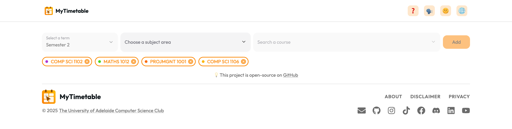
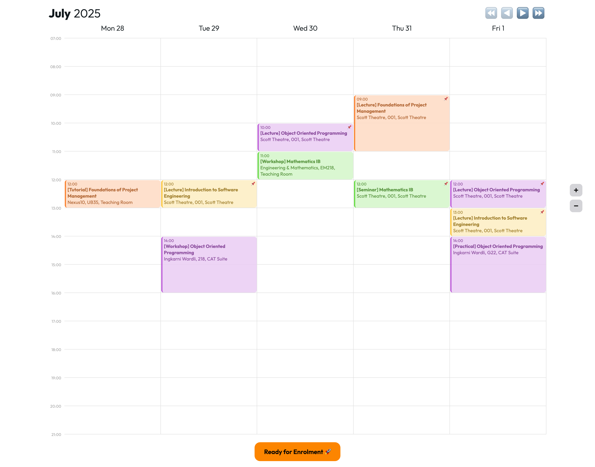
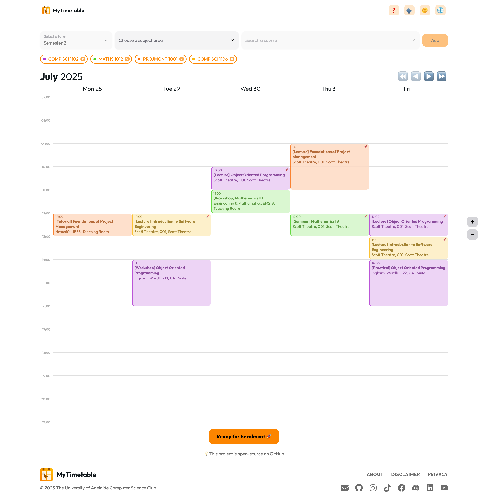

> This task is relevant for **any project with a frontend**
> (CS Club Website, MyTimetable, MyVote).

# CS Club Open Source Team Recruitment Technical Assessment: Frontend
> **YOU DON'T NEED TO COMPLETE ALL PARTS.** 
> Complete the parts that you think **best** reflect your skills (you can do them in any order).

## Introduction
- You will be given an image of a website. **Your goal is to recreate this image as a webpage**.
- You can (and we would prefer) that you implement your solution in this directory, although you may decide to create your own repository
- This is a qualitative technical assessment that will be reviewed by our **Open Source & Infrastructure Manager** and **Open Source Officers** to make a judgment on progressing your application to an interview.
- There aren't specific marks associated with the completion of individual components. Your code will be judged based on its structure, style and adherence to frontend conventions to create a visually similar product to the provided image.

## Tasks
The main goal of these tasks is for you to demonstrate your HTML, CSS and JS/TS skills. 
- You may choose to use a single `.html` file.
- You can also use any frontend framework or library as the foundation of your page.
  - These include but are not limited to `React`, `Vue`, `Angular` as well as `Next.js` or `Gatsby.js`.
- Recreating every single stylistic detail is **NOT** required. Focus first on the main layout and key structural elements before refining smaller visual aspects.
- You don't need to find exact matches for the fonts, icons or logos.
- You don't need to aim for perfection. Please only complete as much of this tasks as you wish focusing on demonstrating the breadth of your frontend knowledge. There is no requirement for perfection or pixel-precise matching.
- For the base implementation, you don't need to account for responsive design (although you may decide to attempt that for **Stretch Task 2**).

### Main Task 1

Please recreate the header and footer of MyTimetable.



The header and footer of the [MyTimetable](https://mytimetable.csclub.org.au/) website is provided above.

**Note**: The buttons and dropdowns don't need to work.

The [MyTimetable](./assets/MyTimetableLogo.svg) icon has been provided as an `svg`. The rest of the assets are either emojis or from a library which has been provided below for your convenience.

Header:
  - [MyTimetable Logo](./assets/MyTimetableLogo.svg)
  - ❓
  - 🗣
  - 🌞
  - 🌐

 Footer: [Font Awesome](https://fontawesome.com/icons)
  - [MyTimetable Logo](./assets/MyTimetableLogo.svg)
  - Envelope
  - GitHub
  - Instagram
  - Tiktok
  - Facebook
  - Discord
  - Linkedin
  - Youtube

### Main Task 2
Please recreate the timetable section of MyTimetable.



The timetable section of the [MyTimetable](https://mytimetable.csclub.org.au/) website is provided above.

**Note**: The timetable section might seem overwhelming at first, but don’t worry! Start by building the basic table structure, then add event cards, and finally include the relevant details for each event. You are **not required** to implement interactive functionality for the buttons or dropdown menus. The calendar does **not** need to support drag-and-drop or any advanced interactions. Just focus on replicating the visual layout.

The sample data shown in the image is provided both in the `data.json` file and below in the [Appendix](#appendix) in `JSON` format.🚀

Timetable Control Emojis:
  - ⏪
  - ◀️
  - ▶️
  - ⏩

Immovable Course Emoji: 📌

Ready for Enrolment Emoji: 🚀

### Both Main Tasks
If you choose to complete both main tasks, your should aim for you page to look like the image below. 




### Stretch Task 1
The goal of this task is for you to demonstrate component state management. When you click on the 🌞 emoji, it should toggle between the 🌞 and 🌚 emojis. While this button represents the theme toggle, you **DON'T** need to implement a dark mode theme.

### Stretch Task 2
For this task, ensure that your site is fully **responsive** across various screen sizes. All elements should adjust dynamically while maintaining a visually appealing and user friendly layout.

For extreme layouts (like mobile), you have the option to redesign certain views to better fit the screen dimensions. You can take inspiration from the current layout of MyTimetable, but you're free to adjust the design as you see fit.

<p align="center">
  
</p>

## Submission
If your solution is not accessible through an `index.html` file or run via a standard `npm i` `npm run start` command, please make an `INSTRUCTIONS.md` file with instructions on how we can open your solution in our browser and any dependencies that we may need.

## Appendix

```json
[
    {
      "course_code": "COMP SCI 1102",
      "subject_name": "Object Oriented Programming",
      "class_type": "Lecture",
      "location": "Scott Theatre, 001, Scott Theatre",
      "day": "Wednesday",
      "time": "10:00-11:00"
    },
    {
      "course_code": "COMP SCI 1102",
      "subject_name": "Object Oriented Programming",
      "class_type": "Lecture",
      "location": "Scott Theatre, 001, Scott Theatre",
      "day": "Friday",
      "time": "12:00-13:00"
    },
    {
      "course_code": "COMP SCI 1102",
      "subject_name": "Object Oriented Programming",
      "class_type": "Workshop",
      "location": "Ingkarni Wardli, 218, CAT Suite",
      "day": "Tuesday",
      "time": "14:00-15:00"
    },
    {
      "course_code": "COMP SCI 1102",
      "subject_name": "Object Oriented Programming",
      "class_type": "Practical",
      "location": "Ingkarni Wardli, G22, CAT Suite",
      "day": "Friday",
      "time": "14:00-15:00"
    },
    {
      "course_code": "MATHS 1012",
      "subject_name": "Mathematics IB",
      "class_type": "Seminar",
      "location": "Scott Theatre, 001, Scott Theatre",
      "day": "Thursday",
      "time": "12:00-13:00"
    },
    {
      "course_code": "MATHS 1012",
      "subject_name": "Mathematics IB",
      "class_type": "Workshop",
      "location": "Engineering & Mathematics, EM218, Teaching Room",
      "day": "Wednesday",
      "time": "11:00-12:00"
    },
    {
      "course_code": "PROJMGNT 1001",
      "subject_name": "Foundations of Project Management",
      "class_type": "Lecture",
      "location": "Scott Theatre, 001, Scott Theatre",
      "day": "Thursday",
      "time": "9:00-11:00"
    },
    {
      "course_code": "PROJMGNT 1001",
      "subject_name": "Foundations of Project Management",
      "class_type": "Tutorial",
      "location": "Nexus1O, UB35, Teaching Room",
      "day": "Monday",
      "time": "12:00-13:00"
    },
    {
      "course_code": "COMP SCI 1106",
      "subject_name": "Introduction to Software Engineering",
      "class_type": "Lecture",
      "location": "Scott Theatre, 001, Scott Theatre",
      "day": "Tuesday",
      "time": "12:00-13:00"
    },
    {
      "course_code": "COMP SCI 1106",
      "subject_name": "Introduction to Software Engineering",
      "class_type": "Lecture",
      "location": "Scott Theatre, 001, Scott Theatre",
      "day": "Friday",
      "time": "13:00-14:00"
    }
]
```
